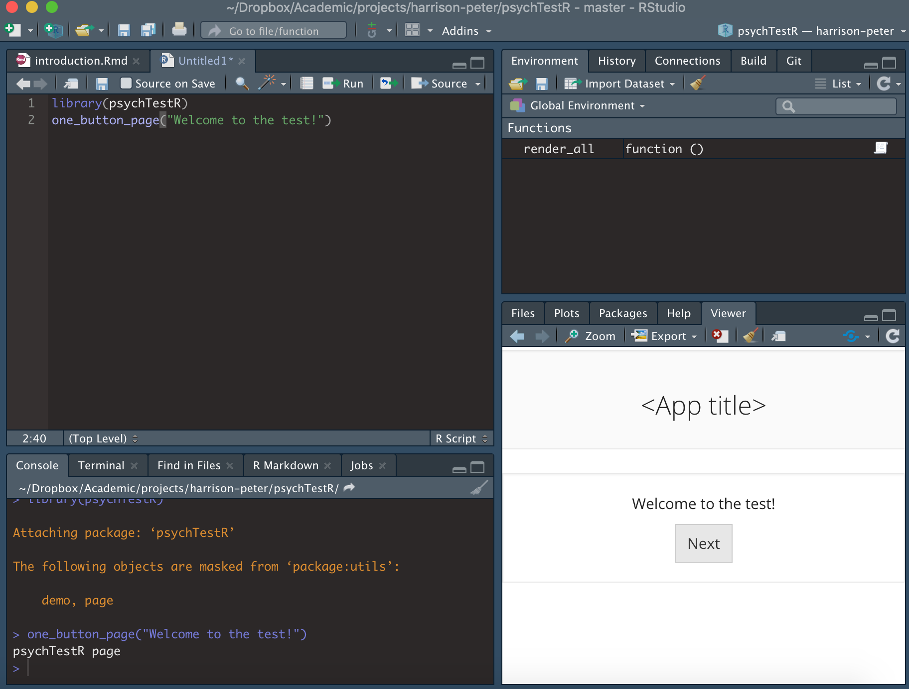
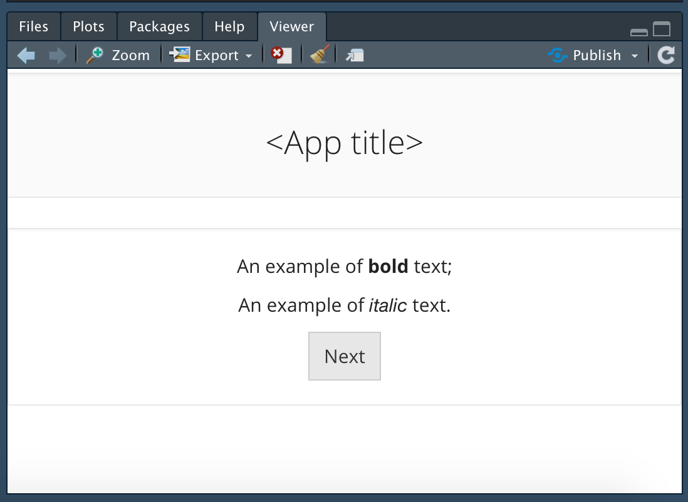
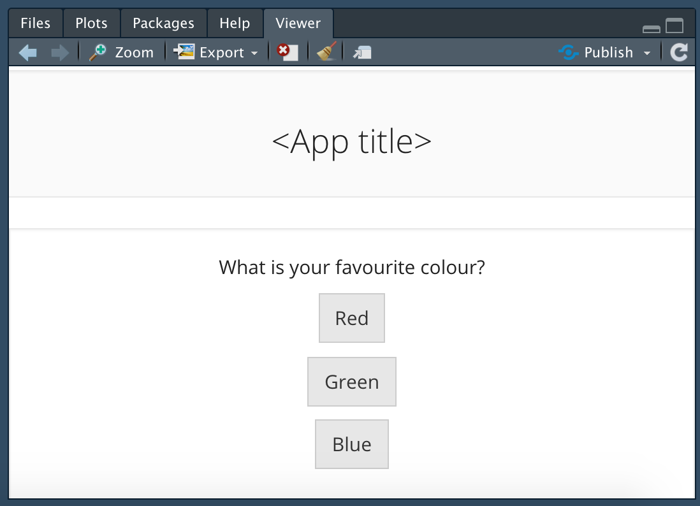
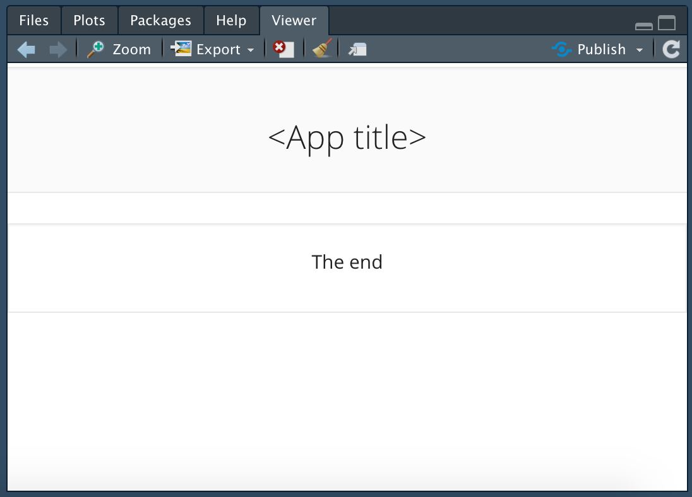
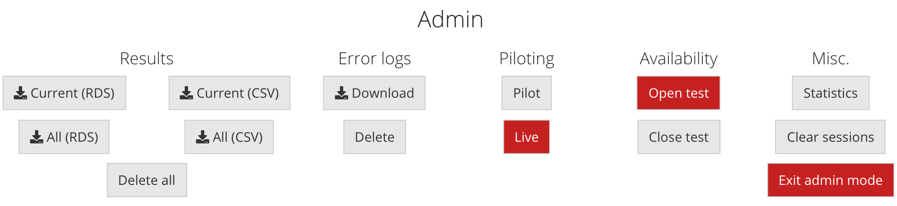
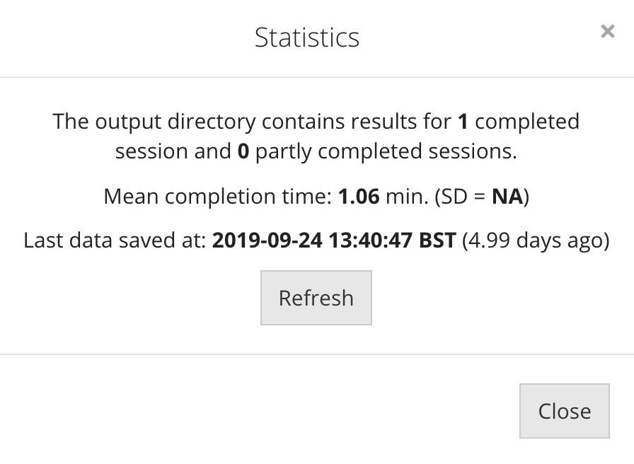

```{r setup, include = FALSE}
knitr::opts_chunk$set(
  echo = FALSE,
  out.width = "100%"
)

library(psychTestR)
```

## About

psychTestR is an R package for developing and administering 
behavioural experiments. This vignette provides a first introduction 
to psychTestR; by the end, you should feel ready to create a simple
psychTestR test of your own.
This introduction assumes that the reader is already moderately familiar
with the programming language R. It also assumes that the reader
has installed psychTestR (see README for instructions) and loaded
it using the following command:

```r
library(psychTestR)
```

## Architecture

psychTestR builds on the web application framework [Shiny](http://shiny.rstudio.com/).
Shiny is a powerful open-source framework that is supported by 
[RStudio, Inc.](http://www.rstudio.com).
The Shiny framework was designed to allow users to construct interactive 
dashboards in R that could easily be deployed to remote servers.
psychTestR specialises Shiny to the application of psychological experiment design,
providing a straightforward way to design linear sequences of test pages
that elicit and record responses from the participant.

Like Shiny, psychTestR uses the 
[htmltools](https://cran.r-project.org/web/packages/htmltools/index.html)
package to programmatically generate HTML code from R code.
This package allows the user to design complex HTML interfaces by composing 
R functions.
htmltools functions can be used directly within psychTestR to construct
highly customisable test interfaces.

Like all Shiny apps, psychTestR tests are hosted on a server running R code.
These tests can be hosted locally from one's own computer,
which is useful both for test development and for conducting 
in-person data collection.
Tests can also be deployed to remote servers for online data collection
without changing any of the underlying R code -- see 
[Hosting experiments online](https://pmcharrison.github.io/psychTestR/articles/2-hosting-experiments-online.html)
for details.

## Pages

The most essential unit of a psychTestR test is the *page*.
Pages display content to the user and optionally collect responses.
The most flexible way of creating psychTestR pages is with the `page`
function.
However, psychTestR also provides many helper functions for creating particular
types of pages, which can often be useful for saving legwork
and increasing readability.
For example, the function `one_button_page` defines a page 
that displays a prompt to the user and provides a single button
with which the user may advance to the next page.
The below code defines a page that displays "Welcome to the test!"
and a "Next" button:

```r
one_button_page("Welcome to the test!")
```

If you run this code in RStudio,
it should display the test element in your Viewer window:

```{r}

```

Here the prompt took the form of raw text, without any HTML specifications.
We can use the `htmltools` package to create such specifications, for example:

```r
library(htmltools)

one_button_page(
  div(
    p("An example of ", tags$strong("bold"), "text;"),
    p("An example of ", tags$em("italic"), "text.")
  )
)
```

```{r}

```

This page doesn't collect any information from the participant.
An example of a page that does collect information is the 
*N-alternative forced choice* page, as created by the `NAFC_page` function.
This function allows the user to specify several choices to the user
which will be displayed as clickable buttons.
The participant must click one of these buttons to advance to the next page,
and their choice will be automatically recorded.

```r
NAFC_page("favourite_colour",
          "What is your favourite colour?",
          c("Red", "Green", "Blue"))
```

```{r}

```

psychTestR contains various built-in page types like these, for example:

- `text_input_page`
- `audio_NAFC_page`
- `video_NAFC_page`
- `dropdown_NAFC_page`
- `final_page`

See the [function-level documentation](https://pmcharrison.github.io/psychTestR/reference/index.html)
(accessible at the R console with e.g. `?text_input_page`)
for more details.

Tests should generally conclude with a *final page*, as produced
by `final_page`: these final pages have no buttons to advance
to the next page, and so provide a good way to end the test.

You can also define custom page types using the general-purpose `page` function.
In our experience, it's useful to use the source code of pre-existing page types
as templates for defining custom page types.
If you think that your page type might be useful to other psychTestR users,
you may consider wrapping it as a function and 
submitting it as a pull request to the 
[psychTestR repository](https://github.com/pmcharrison/psychTestR),
so that it can be incorporated into the psychTestR codebase.

## Timelines

A psychTestR test comprises a sequence of test elements,
termed a *timeline*.
There are three main types of test elements:

- Pages;
- Reactive pages;
- Code blocks.

We will get to reactive pages and code blocks in due course.
First, we'll construct a timeline comprising solely pages.
A timeline may be constructed using the `list` function from base R:

```r
timeline <- list(
  one_button_page("Page 1"),
  one_button_page("Page 2"),
  final_page("The end")
)
```

Note that we concluded the timeline with the `final_page` function.
A *final page* is like a *one-button page*, but without a 
button to advance to the next page. 

```r
final_page("The end")
```

```{r}

```

We can run the resulting test as follows:

```r
timeline <- list(
  one_button_page("Page 1"),
  one_button_page("Page 2"),
  final_page("The end")
)
test <- make_test(elts = timeline)
shiny::runApp(test)
```

As you can see, the function `make_test` takes the input timeline
and turns it into a Shiny app object that can then be run 
with \code{shiny::runApp}.
See `?make_test` for more details.

The resulting test should display in your RStudio Viewer window, 
or in your web browser, depending on your RStudio configuration.

```{r}
knitr::include_graphics("img/introduction/simple-test.png")
```

This test doesn't collect any data. 
Let's define another test that does collect data:

```r
timeline <- list(
  NAFC_page("favourite_colour",
            "What is your favourite colour?",
            c("Red", "Green", "Blue")),
  elt_save_results_to_disk(complete = TRUE),
  final_page("Thanks for completing the survey!")
)
test <- make_test(elts = timeline)
shiny::runApp(test)
```

Note that we have introduced a new builder function,
`elt_save_results_to_disk`. This function doesn't resolve to a 
psychTestR page, but instead resolves to a so-called code block:

```{r, echo = TRUE}
elt_save_results_to_disk(complete = TRUE)
```

Code blocks don't display anything to the user, but instead instruct
the server to run a specified function.
This function can take several inputs, but most important is the `state`
object, which stores information relevant to that particular participant's
testing session, such as their responses to N-alternative forced choice
pages.
This particular function takes the `state` object as input and 
saves the participant's results to disk, paying attention to certain
test configuration options as specified in `opt`.

Having run this test, we should see that it generates an RDS file 
in the directory `output/results`. The name of this RDS file will contain the 
participant's ID, which by default is randomly generated.
RDS files provide compressed versions of R objects.
We can read our RDS file into R using the `readRDS` function.
The code below lists all files in the results directory with the 
extension `.rds`, and reads the first one into R:

```r
rds_files <- list.files("output/results", 
                        pattern = "\\.rds$", 
                        full.names = TRUE)
res <- readRDS(rds_files[1])
res
```

```{r, echo = FALSE}
res <- readRDS("sample-results/ex-1.rds")
res
```

We can visualise this results file with the `as.list` function:

```{r, echo = TRUE}
as.list(res)
```

We see that my favourite colour is green. 
We can also coerce the results file to a tabular format using the
`as_tibble` or `as.data.frame` functions:

```{r, echo = TRUE}
as_tibble(res)
```

## Build time versus test time 

At this point it's worth explaining the difference between *build time*
and *test time*. Build time corresponds to the moment when you create
a list of test elements and pass them to `make_test`.
psychTestR takes all of your builder functions, such as `NAFC_page` and 
`one_button_page`, and evaluates them to produce a series of test elements,
where an individual test element looks like this under the hood:

```{r, echo = TRUE}
as.list(NAFC_page("favourite_colour",
                  "What is your favourite colour?",
                  c("Red", "Green", "Blue")))
```

psychTestR can then refer to these resolved test elements when 
administering them to participants, instead of running the builder functions
(e.g. `NAFC_page`) from scratch each time.

While build time happens before any participants take the test,
test time refers to the participant's testing session itself.
Test time code is useful for things like saving the participant's results,
defining test elements that depend on the participant's actions,
and randomising stimulus administration.

Readers who have written Shiny apps may have written server files 
that look something like this:

```r
library(shiny)

# Run once on app launch
data <- read.csv("data.csv")[, 2]

# Run separately for each user
shinyServer(function(input, output) {
  output$distPlot <- renderPlot({
    bins <- seq(min(data), max(data), length.out = input$bins + 1)
    hist(data, breaks = bins, col = 'darkgray', border = 'white')
  })
})
```

In this example, the function within `shinyServer` is called separately
for each app user, creating an isolated workspace that stores
variables specific to that user's session.
This corresponds to our 'run-time code' in psychTestR.

However, the code example also contains a call to `read.csv` prior 
to the `shinyServer` function, in order to create the `data` object.
This call only happens once, on app launch, and creates an 
R object that is shared by all users sessions.
This corresponds to our 'build-time code' in psychTestR.

This distinction between build-time code and run-time code is 
part of what makes Shiny and hence psychTestR able to efficiently scale
to many concurrent users. Objects that are the same for all participants
may be defined in build-time code, and this object need only be stored 
once in memory. Objects that are specific to individual participants
are then stored in run-time code.

Most psychTestR users never have to interact with the `shinyServer` function
directly. Instead, run-time code is defined as part of the three main
types of test elements: code blocks, simple pages, and reactive pages.
This run-time code depends heavily on the notion of *session state*,
which will now be introduced.

## Session states

Each participant has a so-called 'session state', which characterises
their current position in the test as well as any results or other variables
that have accumulated along the way.
By default, session states are saved to disk in the directory `output/sessions`.^[
If you are interested, you can inspect these session states in R 
using the `readRDS` function. Note however that these objects
are not documented and their structure is subject to change
with future versions of psychTestR.
]
Session states are identifed by the corresponding participant IDs;
each participant ID may be associated with no more than one session state.

The primary role of session states in test development is for 
storing and accessing variables that are specific 
to the particular participant's testing session.
For example, we might define a counter corresponding
to the number of correct responses so far.
These variables are termed *session variables*.

There are two types of session variables: 
*global variables* and *local variables*.
Each variable is identifed by a *key* that simply corresponds to a character
string, such as `"counter"` or `"start_time"`. 
Values may be assigned to these variables using the function
`set_global` (for global variables)
or the function `set_local` (for local variables).
Values may be retrieved from these variables using the functions
`get_global` and `get_local`.

Global variables and local variables differ in their *scope*.
Global variables persist for an entire testing session,
and are accessible to all run-time code.
No more than one global variable can be defined for a given key.
Local variables, meanwhile, only persist for the duration of a module.
A module is a self-contained unit of psychTestR test elements
that uses an isolated set of local variables;
modules can be created using the functions `begin_module` and `end_module`.
Local variables are deleted upon termination of a module.
It is also possible to nest modules;
each nested module will have its own set of local variables,
potentially with variable keys being duplicated across modules.
Run-time code will only have access to the lowest-level module
at that point in the test's timeline.

Manipulating session variables requires run-time code.
As mentioned previously, run-time code can be created for each
of the three main types of test elements:
code blocks, simple pages, and reactive pages.
We will now consider each approach in turn.

## Code blocks

A code block is a test element that solely comprises run-time code
and does not contain a user interface component.
Code blocks may be created with the `code_block` function.
The primary argument to `code_block` is `fun`,
an R function that will be called at run time.
This R function will typically take two arguments:
`state` and `...`.
The `state` argument represents the session state,
whereas the `...` argument captures further optional arguments
that will not be covered here.

Within the code block function, we can access and set session variables
using the four functions introduced above:
`set_global`, `set_local`, `get_global`, and `get_local`.
These functions each require the `state` object to be provided as an input.

Here is an example of a code block that stores the time
when the run-time code was executed:

```r
code_block(fun = function(state, ...) {
  set_global(key = "time_started", 
             value = Sys.time(), 
             state = state)
})
```

Here the \code{key} argument determines the name of the global variable;
the \code{value} argument determines the value that is assigned to the variable;
\code{state} is the state object we've seen before.

We could then refer to this variable later in the test 
to compute the total time taken, 
as in the following example:

```r
save_time_started <- code_block(function(state, ...) {
  set_global(key = "time_started", 
             value = Sys.time(), 
             state = state)
})

compute_time_taken <- code_block(function(state, ...) {
  time_taken <- Sys.time() - get_global("time_started", state)
  msg <- paste0("Time taken: ", format(time_taken, digits = 3))
  shiny::showNotification(msg)
})

make_test(
  list(
    save_time_started,
    one_button_page("Continue when you're ready."),
    compute_time_taken,
    final_page("End")
  ))
```

## Reactive pages

Reactive pages are pages that are created by run-time code.
This is useful when you wish to present the user with randomised stimuli
or other information that is only available at run time.

Reactive pages are defined using the `reactive_page` function.
Like code blocks, the primary argument to this function is the
argument `fun`, taking the form of an R function that must 
accept the argument '`...`'.
At run-time, this function will be called with several input arguments,
including most importantly:

- `state`, corresponding to the participant's session state object;
- `answer`, corresponding to the participant's most recent response.

The reactive page function must return a test page,
which will be displayed to the participant at the appropriate point in the test.

The psychTestR specification requires reactive page functions to be 
*idempotent*, meaning that calling it multiple times should have 
the same effect as calling the function once.
Reactive pages are therefore not the right place to write code
that has side effects, like incrementing counters or saving results.

Here is an example test with a reactive page that displays the current time:

```r
make_test(list(
  reactive_page(function(...) {
    msg <- format(Sys.time(), "The current time is %H:%M:%S.")
    final_page(msg)
  })
))
```

Note that the time updates if you refresh the page.

Here is a second example demonstrating the use of the `answer` argument:

```r
make_test(list(
  NAFC_page("q1", "What is your favourite colour?",
            c("Red", "Green", "Blue")),
  reactive_page(function(answer, ...) {
    msg <- sprintf("Your favourite colour is %s.", answer)
    final_page(msg)
  })
))
```

## Simple pages and run-time code

Often it is useful to associate run-time code with a simple page.
The documentation for simple pages (`?page`) outlines 
various ways of achieving this through different function arguments.
In particular, the following arguments involve run-time code:

### `get_answer`

This is an optional function for extracting the 
participant's answer from the current page. This function should
accept an argument termed `input`, which provides access to 
any input elements that have been defined as part of the page UI.
For example, the UI for `text_input_page` includes a text-box input
defined as follows:

``` r
shiny::textInput("text_input", 
                 label = NULL,
                 placeholder = placeholder,
                 width = width)
```

The first argument to `shiny::textInput` determines the input slot
that will be used to access the value in the text box.
Correspondingly, the `get_answer` argument is defined simply as follows:

``` r
get_answer = function(input, ...) input$text_input
```

It is possible to define more complex `get_answer` functions that 
perform arbitrary post-processing on the user input, for example
by converting text strings to numbers, deleting whitespace, and so on.

### `validate`

`validate` is an optional function that checks whether the participant
has returned a satisfactory response for the current page.
It should return `TRUE` for a successful validation;
for an unsuccessful validation, it should return either `FALSE`
or an error message, expressed as a character string. 
If validation fails then the page will be refreshed, 
usually to give the user a chance to revise their input.
The following code provides a simple example:

```r
make_test(
  list(
    text_input_page("example", 
                    "What is 1 + 1?", 
                    validate = function(answer, ...) {
                      res <- suppressWarnings(as.numeric(answer))
                      if (!is.na(res) && res == 2) TRUE else "Try again!"
                    }),
    final_page("End.")
  )
)
```

### `on_complete`

`on_complete` is an optional function that is run once the page is completed
and all validation checks have passed successfully.
The below example shows a pop-up notification with the current time.

```r
make_test(
  list(
    one_button_page("Hello!", on_complete = function(...) {
      shiny::showNotification(paste0("The current time is ", Sys.time(), "."))
    }),
    final_page("End.")
  )
)
```

## Results

It is typically useful to save some or all of the participant's responses
in a persistent form.
This can be achieved in a fully customisable manner using 
combinations of session variables and run-time code.
However, psychTestR also provides a built-in result management system
that works well for many practical applications.

This system works as follows.
Pages with response options have an associated `get_answer` function
that extracts the participant's answer from the user interface.
If the `save_answer` option is enabled for a given page,
then this answer will be automatically appended to the participant's results store,
with the result's label corresponding to the page's `label` slot.
The results store may optionally be organised into sections,
where each section typically corresponds to a test module.
For example, a results store might look like this:

- Demographics
  - Gender
  - Age
- Personality
  - Openness
  - Extraversion
  - ...
- Admin
  - Preferred payment type
  - Payment code
  
At any one point in time, only one results section will be active.
Saved results will be automatically appended to the active result section.
A new results section may be started by calling the function
`register_next_results_section`.
This function is automatically called at the beginning of a new module.

Where relevant, prebuilt page types (e.g. `NAFC_page`, `text_input_page`)
typically come with automatic results saving.
This automatic saving may be disabled by setting `save_answer = FALSE`.

It is straightforward to implement automatic results saving for new page types.
All that is required is to implement a `get_answer` function
(see `?page`), which shows how to extract the participant's answer
from the user interface, and then save `save_answer` to `TRUE`.
See the source code for prebuilt page types, for example `text_input_page`,
for examples.

The participant's results will not be saved to disk without 
an explicit command. The easiest way to achieve this is with the function
`elt_save_results_to_disk`;
this defines a code block that saves the participant's current results
to the `output/results` directory.
This function may be called multiple times in the test
so as to keep an incrementally updated record of the participant's progress.
Intermediate results should be saved with the argument `complete = FALSE`;
finalised results should be saved with `complete = TRUE`.

Results may then be read into R using the `readRDS` command.
This produces a psychTestR `results` object which can be explored
with various commands:

- `as.list` - converts the object to a list, a format which closely
resembles the original object's data structure.
- `as.data.frame` - attempts to convert the object to a one-row data frame.
This can be useful for combining multiple participants' data into a 
tabular format. However, the function is experimental and might 
given unexpected results if the original results take unusual data structures.
- `as_tibble` - like `as.data.frame` but produces a `tibble` version
of a data frame.

Sometimes it is useful to save results that are not directly returned
from a test page, but instead computed by a code block.
For example, suppose we wanted to evaluate someone's general liking for cheese
on a scale from 1--7, by averaging ratings that they provide for 
three individual cheeses. We could construct the following test:

```r
cheeses <- c("Cheddar", "Brie", "Camembert")
items <- purrr::map(cheeses, function(cheese) {
  NAFC_page(
    label = cheese,
    prompt = paste0("How much do you like ", cheese, "?"),
    choices = as.character(1:4), 
    arrange_vertically = FALSE,
    on_complete = function(answer, state, ...) {
      set_local(cheese, as.numeric(answer), state)
    }
  )
})
save_res <- code_block(function(state, ...) {
  scores <- purrr::map_dbl(cheeses, get_local, state)
  save_result(place = state, 
              label = "cheese_liking",
              value = mean(scores))
})
make_test(join(
  items, 
  save_res,
  elt_save_results_to_disk(complete = TRUE),
  final_page("End")
))
```

Some aside points about the code above:

- We created a list of items using the `purrr::map` function.
This is a nice way of creating a collection of test elements
that only vary along one particular parameter.
See `purrr::pmap` for a more powerful alternative.
- The `save_res` code block refers to an external variable, 
`cheeses`. This is called a "closure": the function "closes over"
the external variable, and carries a permanent reference to it.
This is a useful way to avoid copying constants. Be careful 
though: changes to this external variable after the definition 
of the code block will be propagated to that same code block.
It's best to restrict the use of closures to static variables.
- `purrr::map_dbl` creates a numeric vector where the ith element
is the result of applying the `get_local` function to the ith element
of `cheeses`, with `state` as a supplementary argument.
- In `make_test`, we used the `c` function rather than the `list` function
to combine test elements. This is because `items` was already a list;
the `c` function combines this list with the remaining test elements,
with the outcome being a single list of test elements
rather than a nested list.

Having taken the test once, and reading the results from disk,
we get something like this:

```{r, echo = TRUE}
as.list(readRDS("sample-results/ex-2.rds"))$results
```

So, we've successfully created a new result termed `"cheese_liking"`
corresponding to the mean score for the three cheeses.

## Admin panel

The admin panel provides an interface to the "back end" of the 
testing environment. 
Ths is particularly useful for online testing.
By default, the testing interface contains a link at the bottom of the 
screen labelled "Admin login":

```{r, out.width = '50%', fig.align = 'center'}
knitr::include_graphics("img/introduction/admin-login.png")
```

Clicking this link launches a login screen, where you are prompted
to enter your password. This password should be provided 
as part of the `opt` argument to `make_test`; 
the default password is "demo".

This activates a range of admin controls at the bottom of the screen.

```{r, out.width = '100%', fig.align = 'center'}

```

These admin controls provide access to various functionalities.

### Downloading results

Results can be downloaded either as RDS or CSV files.
CSV files are derived by applying the `as.data.frame` function
to the participants' results objects,
and should comprise one row per participant.

### Piloting

It is possible to switch the test between 'pilot' and 'live' modes.
These two modes behave exactly the same,
except pilot participants do not contribute to participation statistics,
and pilot participants are marked as such in their results files.
Mode switching persists across multiple sessions and multiple test launches;
it currently works by writing a file to the working directory.

### Availability

This feature allows the researcher to close the test to new participants
via the admin panel. This is mainly useful for online studies.
Like the piloting control, this command persists across multiple sessions
and multiple test launches by writing to the working directory.

### Statistics

This button launches another panel that summarises participation statistics
for the current test, including numbers of partial and completed sessions
as well as mean completion times.

```{r, out.width = '85%', fig.align = 'center'}

```

### Custom admin panel components

It is also possible to construct custom admin panel components using
the `custom_admin_panel` component of `make_test`.
This process is a bit complicated and will not be covered here - 
see instead `?make_test`.

### Error logs

Error logging functionality has yet to be completed.
Instead we recommend using the error logging capabilities present in 
base R and Shiny Server.

## Internationalisation

It is sometimes useful to construct psychTestR tests
that support multiple languages.
The first step in creating such a test is to define a *dictionary*.
A dictionary comprises a collection of *keys*,
e.g. "welcome_message" or "correct_feedback",
with each of these keys being associated with one or more translations
in various languages.
For example, the key `"colour"` might return "What's your favourite colour?"
if the language is English, or "Quelle est ta couleur préférée?"
if the language is French.

psychTestR dictionaries are created as instantiations of the R6 class
`i18n_dict`. A dictionary may be created by calling the `$new()` method
with a data frame as the first argument,
where the data frame satisfies the following properties:

- Each row corresponds to a term to be translated.
- There is a character column entitled `key` that defines the key for each term.
- The remaining columns provide translations into different languages,
with the languages being identified by the column names, according
to [ISO 639-2 conventions](http://www.loc.gov/standards/iso639-2/php/code_list.php).

By default the text is parsed according to Markdown conventions, 
with one addition: two successive backslashes 
(written `\` in a text file, or `\\` in R) are interpreted as a new paragraph.
This behaviour can be disabled by calling the `$new()` method with
`markdown = FALSE`.

Let's define a simple dictionary:

```{r, echo = TRUE}
df <- data.frame(key = c("name", "hello", "bye"),
                 EN = c("Peter", "Hello", "Goodbye"),
                 FR = c("Pierre", "Bonjour", "Au revoir"))
df
dict <- i18n_dict$new(df)
```

<!-- We then need to modify our workflow in two ways to incorporate internationalisation: -->

Whenever we want to include internationalised text in our test elements,
we use the `i18n` function with the appropriate key as its first argument.
For example, to translate a name using the above dictionary, we would write
`i18n("Peter")`.
However, it is not possible to call `i18n("Peter")` by itself, because the function
will not know what dictionary to use or what language to translate to.
Instead, `i18n` must be wrapped somewhere inside a call to `new_timeline`.
This `new_timeline` is a macro that takes two primary arguments -- 
an expression that evaluates to a list of test elements, 
and a dictionary --
and evaluates the expression multiple times,
once for each language in the dictionary,
translating calls to `i18n` into the relevant languages.

The resulting timeline object comprises one list of test elements
for each available language.
This timeline object can be passed to `make_test` to produce
an internationalised test.

Note that previously we just passed `make_test` a list of test elements.
In this case, the function internally coerces this list into a timeline
representation, assuming that these test elements all correspond to the
same language. We could have equally passed `make_test` a timeline
created by `new_timeline` without any calls to `i18n`.

Here is a straightforward example that uses the dictionary defined above:

```r
timeline <- new_timeline(
  list(
    one_button_page(paste0(i18n("hello"), " ", i18n("name"))),
    final_page(i18n("bye"))
  ),
  dict = dict
)
```

The following code should launch the test in English:

```r
make_test(timeline, opt = demo_options(languages = "EN"))
```

The following code should launch it in French:

```r
make_test(timeline, opt = demo_options(languages = "FR"))
```

For a more involved example, see 
[Creating an internationalised questionnaire](https://pmcharrison.github.io/psychTestR/articles/d-internationalised-questionnaire.html).

## Best practice in test construction

Several best-practice programming principles apply equally well to psychTestR:

1. **Avoid copying and pasting**. 
If you find yourself using the same code twice,
ask yourself whether the code can be better expressed as some kind of function
(or similar) that can be called multiple times.
Such code is typically easier to read and easier to maintain.
These functions can span in scale from single page templates
all the way to modules representing entire perceptual tests.
2. **Avoid long blocks of code**.
Long blocks of code are hard to read and maintain because they place 
greater demands on working memory. Where possible, try to break up long
blocks of code into functions or other R objects that are defined separately.
3. **Separate data from code**.
Questionnaires are often most naturally expressed in some kind of tabular format.
We recommend storing the textual content of such questionnaires 
in tabular format (CSV files, data frames, tibbles)
and programmatically generating psychTestR content from these tables.

As mentioned previously, psychTestR includes various prebuilt test components
that can facilitate test construction 
(e.g. `one_button_page`, `NAFC_page`, `text_input_page`).
However, particular tests will often demand additional customisability
over what is supported by these prebuilt elements.
In these cases, we recommend defining new page builder functions with
reference to psychTestR's prebuilt functions, and taking advantage of the 
way in which the htmltools and shiny packages allow you to construct
complex user interfaces through R code.
This process is more involved than simply using psychTestR builder functions,
but it allows for a huge flexibility in the kinds of pages that can be 
administered.

## Conclusion

This article has provided an overview of the core functionality of psychTestR.
If you understand the principles described here,
then you should be able to construct sophisticated behavioural experiments
completely within the R programming language.

Two other sources of documentation should prove useful as you progress
with psychTestR. One is the 
[function-level documentation](https://pmcharrison.github.io/psychTestR/reference/index.html), which is also available from the R console using commands such as 
`?while_loop`. The other documentation source is the collection of 
documentation articles hosted on the
[psychTestR website](https://pmcharrison.github.io/psychTestR).
